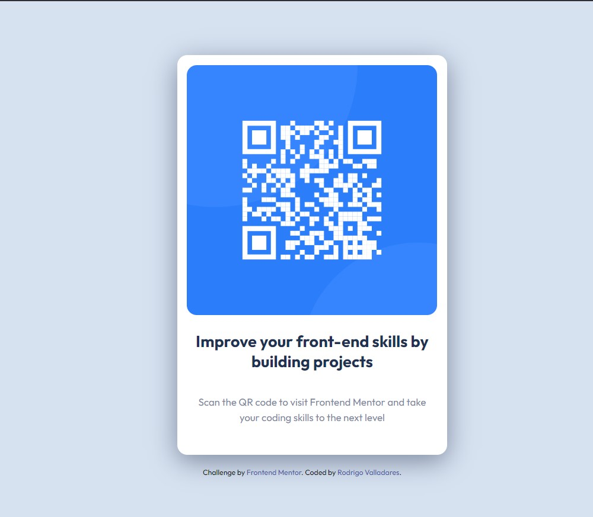

# Frontend Mentor - QR code component solution

This is a solution to the [QR code component challenge on Frontend Mentor](https://www.frontendmentor.io/challenges/qr-code-component-iux_sIO_H). Frontend Mentor challenges help you improve your coding skills by building realistic projects.

## Table of contents

- [Overview](#overview)
  - [Screenshot](#screenshot)
  - [Links](#links)
- [My process](#my-process)
  - [Built with](#built-with)
  - [What I learned](#what-i-learned)
  - [Continued development](#continued-development)
- [Author](#author)

## Overview

### Screenshot



### Links

- Solution URL: [Add solution URL here]([https://)](https://github.com/RoValladares/qr-code-component-main.git)
- Live Site URL: [Add live site URL here]([https://](https://rovalladares.github.io/qr-code-component-main/))

## My process

### Built with

- Semantic HTML5 markup
- CSS custom properties
- Flexbox
- Mobile-first workflow
- [Google Fonts](https://fonts.google.com/) for typography

### What I learned

While working on this project, I refined my skills in:

- Using **flexbox** for centering elements both horizontally and vertically:

```css
body {
  display: flex;
  justify-content: center;
  align-items: center;
  height: 100vh;
  background-color: hsl(212, 45%, 89%);
}
```

- Properly linking external resources like Google Fonts to ensure typography renders correctly:

```html
<link href="https://fonts.googleapis.com/css2?family=Outfit:wght@400;700&display=swap" rel="stylesheet">
```

- Structuring a simple and accessible HTML layout for better readability and usability.

### Continued development

In future projects, I plan to:

- Explore advanced responsive design techniques to handle a wider range of screen sizes.
- Experiment with CSS animations to enhance user experience.
- Focus on improving accessibility, such as testing with screen readers and adding ARIA labels where necessary.

## Author

- Frontend Mentor - [@RodrigoValladares](https://www.frontendmentor.io/profile/RoValladares)
- GitHub - [Rodrigo Valladares](https://github.com/RoValladares)
